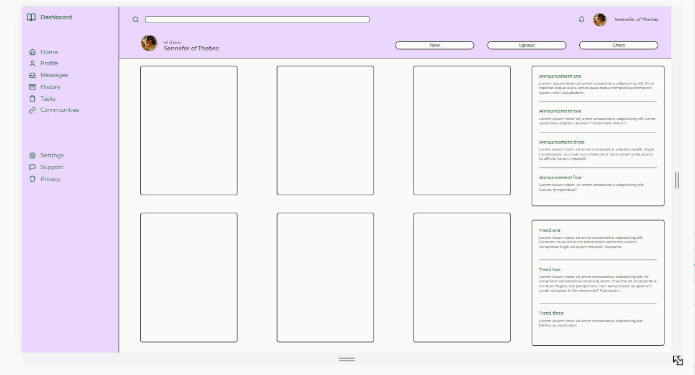

# Dashboard project from TOP

#### [Link to project](https://www.theodinproject.com/lessons/node-path-intermediate-html-and-css-admin-dashboard)

#### [Live demo](https://tomcoso.github.io/dashboard/)

## Process

1. Main layout grid

   Basic grid responsiveness, not bothering about switching to mobile form yet (sorry about the bad gif framerate).

   

2. Added sidebar layout

   Created a provisinal color palette for testing, got svg icons from [feather](https://feathericons.com/). Font is Montserrat, from google fonts.

   

3. Added header layout

   It took a while to make everything stay where it was supposed to with grid, while also making it responsive.

   

4. Added sidebar basic responsiveness 

   Since it is made of `
`s I havent added functionality but that is easily added through javascript. But maybe I could try using buttons and labels instead if it where needed.

   

5. Added content layout

   I made the card wrap automatically using `auto-fit`. I also added hidden scrollbars in case of overflow to the main panel and to the right side panel so that it doesnt affect the position of the header and sidebar, and because who likes annoying scrollbars?

   

6. Finished styling

   I realised I did all the previous steps on zoom 75%, so I had to refactor everything. But I took the opportunity to change the palette to make it look fresher and less cramped.

   

7. Started using media queries for mobile display

   I started doing a popup sidebar using `@media` queries and a bit of javascript to code the button(s).

   

8. Complete responsiveness for mobile use

   Using 2 media queries I managed to shift most of the layout for optimate use on mobile devices. I learned a lot about `@media` queries and specially about code organization and planning, since refactoring the most basic grid layouts was necessary to make it mobile friendly.

   